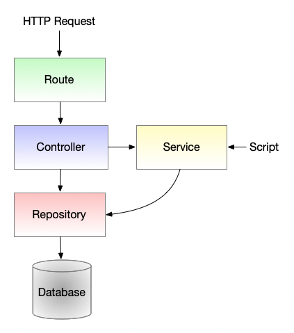

# Table of Contents
1. [Architecture](#architecture)
2. [Requirements](#requirements)
3. [Project Structure](#project-structure)
   1. [Root dir](#root-dir)
   2. [src](#src)
4. [Features](#features)
   1. [Database](#database)
   1. [Database Migration](#database-migration)
   2. [Generic CRUDs](#generic-cruds)
   3. [Generic Error handling](#generic-error-handling)
   4. [Hooks](#hooks)
   5. [Logging](#logging)
   6. [Tests](#tests)
5. [Getting Started](#getting-started)

## Architecture
Boilerplate setup with:
 - Express
 - Typescript
 - TypeORM

 This boilerplate is configured in a 3 tier architecture: 
 

**Route** tier takes care of:
- Redirecting incoming requests to the expected controller
- Handling responses

**Controller** tier takes care of:
- Applying bussiness rules

**Repostiroy** tier takes care of:
- Acessing database

**Service** tier is meant to be used whenever a code must be used for both controller and scripts.

## Requirements
 - Node 14.1.0 or higher
 - Docker
  
## Project Structure

#### Root dir

| Name           | Description   |
|----------------|---------------|
| /data          | MySQL data    |
| /dist          | Server built  |
| /logs          | Server logs   |
| /node_modules  | Dependencies  |
| /src           | Server source |
| /test          | Tests         |

#### src

| Name                | Description   |
|---------------------|---------------|
| /config             | Server config files such as Log and Database configurations |
| /controller         | Controller tier |
| /entity             | Database entities definition |
| /enum               | Server enums |
| /errors             | Custom server errors |
| /initializer        | Initializer that must run when server is being initialized |
| /interface          | Server interfaces |
| /migration          | Database migration files |
| /repository*        | Repository tier |
| /route              | Route tier|
| /service            | Service tier used for sharing functions that are going to be used by the server and scripts|
| /type               | Server types |

*Repository tier is not being used in this boilerplate since TypeORM offers a great repository tier.

## Features

#### Database
There are 2 MySQL docker instance configure on docker-compose.yaml:
 - mysql: used for development.
 - mysql-test: used for running tests.
Database data is being stored under $ROOT_DIR/data/

You can drop your schema by running:
    npm run db:drop

You can reset your database by running:

#### Database Migration
Database migrations are located under /src/migration.

For applying all migrations into your current database, run:
    npm run migration:apply
For reverting, run:
    npm run migration:revert

#### Generic CRUDs
This project enables out-of-the-box CRUDS.
This is possible due to AbstractController and AbstractRoute.
If you do not need this functionality or do not want to use it, you can remove these files.

In order to create a new CRUD you must do the following:

1. Create your new entity (under /src/entity/)
   1. Add annotations for both TypeORM and class-validator.
2. Create a new Response Type (under /src/type/response/entity/)
3. Create a new controller (under /src/entity/)
   1. This controller must extend AbstractController
   2. You must provide your new entity/response type to AbstractController
   3. Implement responseParser.
   4. Check ProjectController for more details
4. Create a new route (under /src/route)
   1. This route must extend AbstractRoute
   2. You must provide your new entity/response type/controller to AbstractRoute

#### Generic Error handling
Generic error handling is configured under RoutesInitializer.
Any exepction thrown within an express route will be captured and handled gracefully.

#### Hooks
Pre-commit hook is configured with Prettier and Linter.

#### Logging
Logs are being printed in both file and console.
Morgan middleware is being used for printing all incoming requests and its status.
Winston is being used for custom log messages.
Winston is configured with rotation so that logs can be separated on a daily basis.
Log files are being generated under $ROOT_DIR/logs/

#### Tests
Tests are setup with Jest and Supertest.
Test files are being stored under $ROOT_DIR/test/

For running all tests:
    npm run test

## Getting started

1- Clone repository

    git clone https://github.com/luis-carlos-campos/ts-node-base.git
    cd ts-node-base

2- Install dependencies

    npm install

3- Start docker containers

    docker-compose up -d

4- Start dev server

    npm run start:dev

## Building

You can build the project by running:
    npm run build

Compiled code will be available under $ROOT_DIR/dist/

You can also start the production version by running:
    npm run start:prod